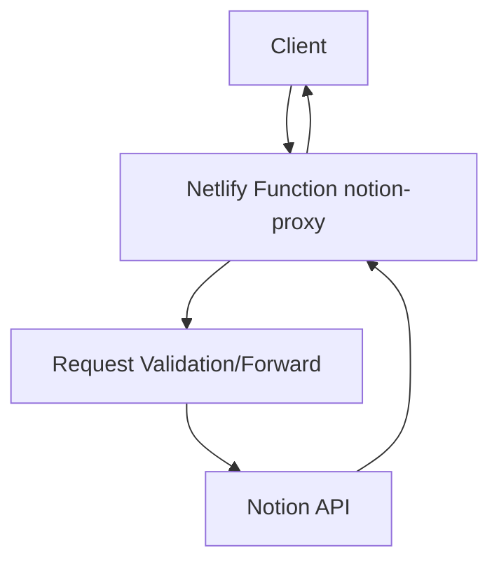
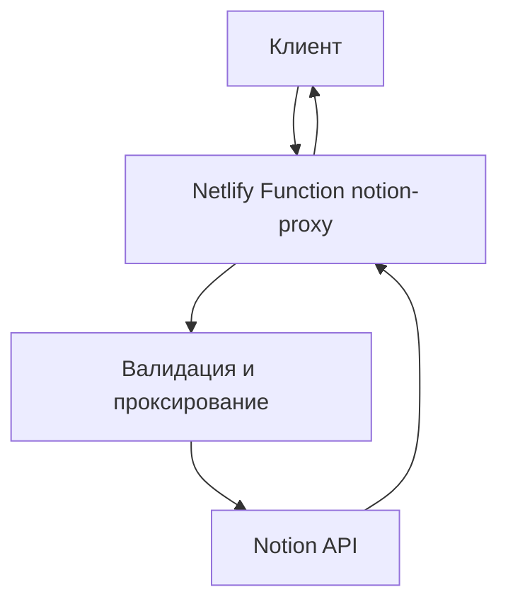

# notion-proxy

## English

## Problem
Direct Notion API calls from clients can expose secrets and complicate request shaping for serverless integrations.

## Solution
`notion-proxy` is a Netlify serverless proxy that forwards controlled requests to Notion API and keeps auth handling on backend side.

## Tech Stack
- Node.js
- JavaScript (ESM)
- Netlify Functions
- Notion API
- `node-fetch`

## Architecture
Top-level structure:
```text
netlify/
public/
netlify.toml
package.json
```



## Features
- Proxy `/api/*` style Notion requests
- Keeps Notion auth token out of frontend code
- Supports endpoint/method/body forwarding
- Includes debug helper endpoint in current implementation

## How to Run
```bash
npm install
npx netlify dev
```

Use `Authorization: Bearer <NOTION_API_KEY>` in request headers.

## Русский

## Проблема
Прямые вызовы Notion API с клиента могут раскрывать секреты и усложнять безопасную интеграцию в serverless-сценариях.

## Решение
`notion-proxy` — это serverless-прокси на Netlify, который проксирует управляемые запросы в Notion API и держит работу с авторизацией на backend-стороне.

## Стек
- Node.js
- JavaScript (ESM)
- Netlify Functions
- Notion API
- `node-fetch`

## Архитектура
Верхнеуровневая структура:
```text
netlify/
public/
netlify.toml
package.json
```



## Возможности
- Проксирование запросов к Notion API
- Сокрытие Notion-токена от фронтенда
- Передача endpoint/method/body в прокси-запросе
- Debug endpoint в текущей реализации

## Как запустить
```bash
npm install
npx netlify dev
```

Используйте заголовок `Authorization: Bearer <NOTION_API_KEY>`.
